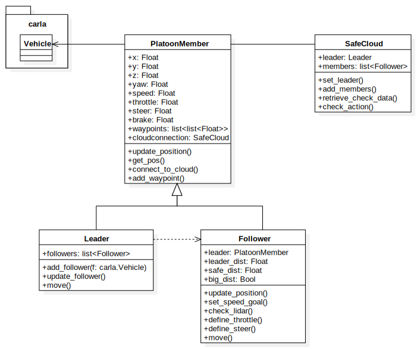

# Introduzione

La repository contiene degli script sviluppati in Python per ricreare una situazione di platooning sfruttando il simulatore CARLA.

# Tecnologie usate

Per poter utilizzare correttamente gli script prodotti è necessario
soddisfare alcuni vincoli di installazione. Raccomando di seguire il
tutorial di installazione rapida di CARLA consultabile a questo
[link](https://carla.readthedocs.io/en/latest/start_quickstart/), ma se
si desidera saltarlo qui sotto sono riportate le dipendenze software.

  - [CARLA v0.9.13 ](https://github.com/carla-simulator/carla/releases);

  - \[Opzionale\] [Paccheto mappe aggiuntive per CARLA
    v0.9.13](https://github.com/carla-simulator/carla/releases);

  - [Python 3.7](https://www.python.org/downloads/);

  - pip o pip3 aggiornato;

  - \[Python package\] NumPy

Di fondamentale importanza è verificare che la versione di Python sia
quella indicata, versioni più recenti impediscono agli script di
recuperare il package `carla`, fondamentale per l’interazione con il
server.  
Sono inoltre necessari altri requisiti non legati alla parte software,
ovvero:

  - GPU con minimo 6GB di memoria dedicata, raccomandati 8GB;

  - 20GB di spazio su disco;

  - due porte TCP libere (di default corrispondono alle porte 2000 e
    2001)

# Istruzioni per l’interazione

La comunicazione tra script dell’utente e il simulatore è permessa
dall’API fornita da CARLA. Il simulatore assume il ruolo di server e
quando si scrive uno script bisogna connettersi ad esso per poter
provocare degli effetti sul mondo virtuale.  
In linea generale, prima di poter avviare una qualsiasi interazione,
bisogna sempre connettersi alla porta su cui è stato eseguito il
simulatore e recuperare lo stato del mondo.  
Tutte le entità che si generano, come possono essere veicoli, sensori o
altro, non vengono eliminate quando termina lo script, quindi è bene
salvarle all’interno di una lista per poi invocare il comando di
distruzione su tutti gli elementi di questa. Le entità prendono il nome
di attori, la cui lista completa e le istruzioni per generarli possono
essere consultate a questo
[link](https://carla.readthedocs.io/en/latest/core_actors/).  
Per agevolare l’approccio iniziale, ho fornito un file denominato
`template.py` in cui sono già state risolte le questioni sopra
riportate. In questo modo si può usare come base iniziale per i nuovi
script, scrivendo da subito codice utile alla generazione di effetti.

# Analisi del codice e modello di comunicazione

Per ricreare una situazione di platooning ho adottato un modello che non
prevede l’utilizzo di intelligenza artificiale o reti neurali. Viene
istanziato un veicolo che svolge il ruolo di leader del platoon e si
occupa di registrare la sua posizione dentro ad una lista di waypoints.
In questa lista vengono salvate le coordinate del veicolo (x ed y),
l’inclinazione (yaw) e il livello di sterzata (steer). Queste
informazioni sono contenute a loro volta in una lista, quindi i waypoint
si presentano in questo modo:  
`waypoints=[[x0, y0, yaw0, steer0], [x1, y1, yaw1, steer1], ...]`  
Contestualmente al salvataggio, manda poi questa traccia a tutti i
follower che prendono parte al platooning.  
I follower invece sono studiati con le direttive che seguono:

  - seguire le tracce lasciate dal leader;

  - replicare la velocità dettata dal leader, aumentandola o
    diminuendola in base alle situazioni;

  - controllare la distanza dal membro del gruppo da cui sono preceduti.

Per eseguire le azioni sopra riportate, ho sviluppato una
rappresentazione in classi che contiene al suo interno un riferimento al
veicolo del package di CARLA. In questo modo i veicoli raggiungono un
livello di astrazione superiore che li dota dei metodi necessari alla
comunicazione e all’impostazione dei parametri di guida. Di seguito
è visibile un diagramma delle classi menzionate:

  
Come si può notare, è anche presente una classe chiamata `SafeCloud`, il
cui compito è quello di controllare e gestire il platoon. Quando si
istanzia una classe che rappresenta un veicolo, essa va connessa al
cloud, il quale si occupa di impostare il leader o aggiungere membri
follower alla coda. Oltre a questo, il cloud esegue un controllo dei
parametri risultanti dal calcolo della traiettoria da seguire dei
follower e dal calcolo dell’accelerazione/frenata. In questo modo si
controlla se ci sono delle inconsistenze nell’esecuzione dei comandi e
viene segnalata l’anomalia.  
Ultimo, ma non meno importante, è il metodo di movimento, denominato per
l’appunto `move()`. Questo metodo va chiamato sia per il leader che per
i follower quando si riceve un segnale di `tick` dal server. Il `tick`
scandisce il tempo di esecuzione dei comandi e chiamando il metodo di
movimento su tutti i veicoli allo stesso momento si riesce ad ottenere
un livello di sincronia sufficiente a seguire le tracce nel miglior modo
possibile, senza dover ricorrere a correzioni di traiettoria importanti.

# Lavoro extra - Analisi dello script di riconoscimento della corsia

Inizialmente avevo tentato di implementare un sistema di riconoscimento
della corsia per i veicoli virtuali. Purtroppo questa strada è stata poi
abbandonata a causa del tempo che sarebbe stato necessario ad ottenere
risultati consistenti. Facendo uso di reti neurali potrebbe, tuttavia,
portare a risultati molto soddisfacenti e sarebbe un’ottima aggiunta al
sistema realizzato. Il file `lane_detector.py` fornisce un funzione che
prende in input un immagine e la elabora in modo da identificare le
strisce delle corsie. Una volta fatto, individua il centro della corsia
e l’angolo compreso tra essa e la traiettoria del veicolo. Ritornando
questo valore si potrebbe regolare la direzione di un’auto partendo dai
dati dell’immagine, anziché basarsi totalmente sui dati inviati dal
veicolo leader. Di seguito sono riportati i passi di trasformazione
dell’immagine in ordine di applicazione:

  - edge detection sull’immagine originale;

  - definizione del poligono della Region Of Interest (ROI);

  - applicazione della ROI all’immagine;

  - thresholding dell’immagine per individuare solo le righe bianche;

  - riempimento delle zone individuate con la Trasformazione di Hough;

  - individuazione del punto centrale della corsia;

  - calcolo dell’angolo di sterzata;

  - salvataggio dei risultati e ritorno dell’immagine elaborata e
    dell’angolo.

L’algoritmo è stato testato su alcune immagini che presentano pochi
elementi invalidanti e ha prodotto risultati accettabili. Per
migliorarne la stabilità, filtrare il rumore dell’immagine e definire
una ROI differente in base ad una specifica situazione è necessario
ricorrere a modelli di apprendimento automatico.

# Problemi noti e considerazioni

Di seguito è consultabile una lista di problemi riscontrati durante il
periodo in cui mi sono occupato del progetto:

  - per platooning di dimensioni >=3 i veicoli assumono
    comportamenti imprevedibili, in particolare il leader, che non
    dovrebbe mai avere problemi a rispettare le regole stradali in
    quanto gestito direttamente dal simulatore;

  - il sistema di correzione della traiettoria può essere migliorato,
    possibilmente andando ad integrare lo script di riconoscimento della
    corsia oppure trovando il modo di rappresentare il punto da
    raggiungere in coordinate relative alla posizione del veicolo
    anziché mantenerle assolute come allo stato attuale;

Se si desidera consultare una spiegazione più approfondita
dell’implementazione dei vari algoritmi e del modello matematico alla
base delle correzioni di traiettoria lascio il riferimento alla mia tesi
di laurea recuperabile all'interno della cartella `docs`.
